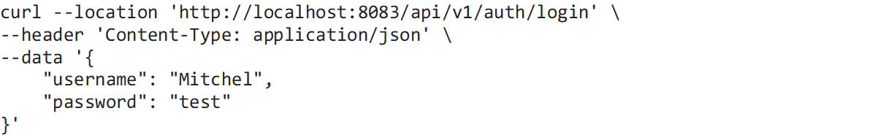

Приложение с использованием следующих технологий:
•	Spring Boot 3
•	Spring Security (JWT)
•	Spring WebFlux
•	Spring Data R2DBC
•	MapStruct
•	PostgreSQL
•	Flyway

# Локальный запуск приложения

•	Установить PostgreSQL

# Создать БД

CREATE DATABASE "webflux_security";

# Установить корректные значения в application.yml

spring:r2dbc:username
spring:r2dbc:password

# cURL запросов:

1. Регистрация пользователя

Пример ответа:

2. Аутентификация пользователя

Пример ответа

3. Получение данных пользователя с использованием токена, полученного в предыдущем запросе

Пример ответа

